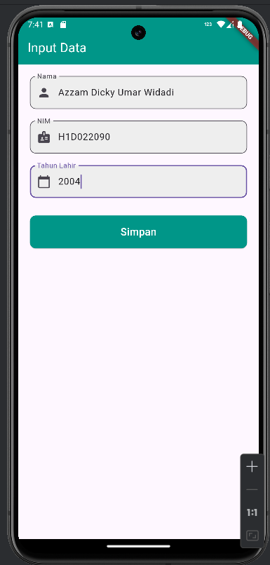
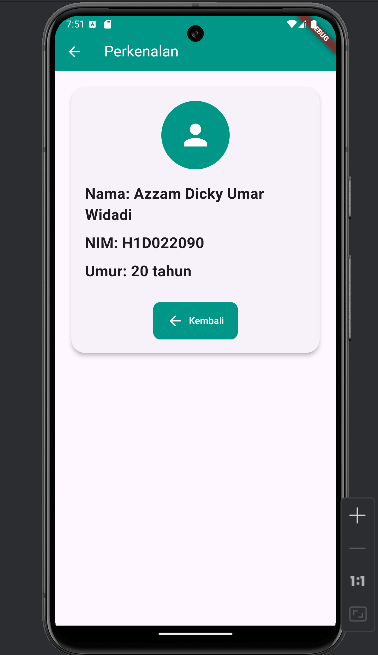

# Tugas Pertemuan 2

Nama: Azzam Dicky Umar Widadi 
NIM: H1D022090  
Shift Baru: F

## Penjelasan Proses Passing Data dari Form ke Tampilan

#### 1. Mengisi data di FormData (`form_data.dart`)
- form_data halaman yang memiliki 3 inputan data yaitu nama, NIM, dan tahun lahir.
- Masing-masing TextField menggunakan `TextEditingController` untuk mendapatkan dan mengelola teks yang telah diinputkan: 
  ```dart
  final _namaController = TextEditingController(); // untuk input nama
  final _nimController = TextEditingController(); // untuk input NIM
  final _tahunController = TextEditingController(); // untuk input tahun lahir
  ```
- Kemudian saat button simpan diklik, fungsi `onPressed` akan dijalankan
  - data yang telah diinputkann pada form diambil menggunakan `.text`
  ```dart
  String nama = _namaController.text;
  String nim = _nimController.text;
  int tahun = int.parse(_tahunController.text);
  ```
- Melalui `Navigator.of(context).push()` memerlukan data yang telah diambil untuk membuat objek pada `TampilData` dan berpindah halaman baru ke halaman `TampilData`

#### 2. Halaman TampilData (`tampil_data.dart`)
- Halaman `TampilData` menerima tiga parameter melalui konstruktor yang telah dipassing dari `FormData` 
- Nilai dari parameter ini kemudian digunakan untuk menampilkan informasi di halaman `TampilData`, seperti nama, NIM, dan umur.
## Screenshot
Contoh :


